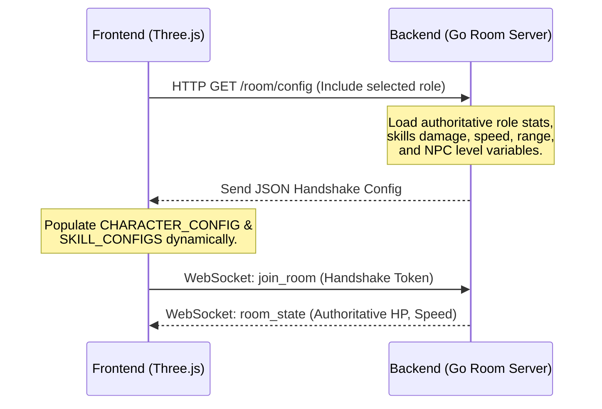

# Architectural Blueprint: Multi-Role & Backend-Authoritative Stats System

Dokumen ini merinci rencana arsitektur dan implementasi untuk migrasi sistem peran player (*roles*) serta penentuan seluruh statistik (*player stats*, *enemy stats*, *skill damages*, *levels*) secara terpusat dan otoritatif (*Server-Authoritative*) dari backend Go ke frontend Three.js.

---

## 1. Desain Peran Player (Multi-Roles)
Sistem akan mendukung 5 peran dasar (*archetypes*) dengan karakteristik visual, senjata, jangkauan serang, dan stats unik:

| Role | Playstyle | Primary Weapon | Base Stat Focus | Primary Skills |
| :--- | :--- | :--- | :--- | :--- |
| **Archer** | Ranged DPS | Bow | High Attack Speed, Normal HP | Double Shot, Arrow Volley |
| **Knight** | Melee DPS | Greatsword / Sword | Balanced Attack/Defense, High HP | Whirlwind, Dash Slash |
| **Tank** | Melee Defense | Shield + One-Handed | Max HP, Max Defense, Slow Speed | Shield Bash, Taunt Aura |
| **Assassin**| Melee Burst | Dual Daggers | Critical Chance, High Speed, Low HP | Shadow Step, Poison Dagger |
| **Mage** | Ranged Magic | Staff | Spell Damage, AoE control, Low HP | Fireball, Meteor Rain |

---

## 2. Server-Authoritative Stats Architecture

Untuk mencegah kecurangan (*cheat*) dan menyederhanakan pemeliharaan game balance, seluruh perhitungan stats diatur di sisi backend:



---

## 3. Implementasi Sisi Backend (Go Engine)

### A. Struktur Data Konfigurasi (`config.go`)
Definisi model stats baru yang mencakup data Role Player dan data detail Enemy:

```go
// Definisi data per-role player
type PlayerRole string

const (
	RoleArcher   PlayerRole = "archer"
	RoleKnight   PlayerRole = "knight"
	RoleTank     PlayerRole = "tank"
	RoleAssassin PlayerRole = "assassin"
	RoleMage     PlayerRole = "mage"
)

type RoleConfig struct {
	MaxHp            int     `json:"maxHp"`
	Speed            float64 `json:"speed"`
	BaseAttackSpeed  float64 `json:"baseAttackSpeed"`
	RateOfFire         float64 `json:"rateOfFire"`
	AutoAimRange     float64 `json:"autoAimRange"`
	ProjectileSpeed  float64 `json:"projectileSpeed"`
	ProjectileMaxDist float64 `json:"projectileMaxDist"`
	ModelPath        string  `json:"modelPath"`
	Scale            float64 `json:"scale"`
}

// Detail Statistik Otoritatif Enemy/NPC
type NPCTemplate struct {
	Type         string          `json:"type"`
	MaxHp        int             `json:"maxHp"`
	Speed        float64         `json:"speed"`
	Level        int             `json:"level"`
	AttackRange  float64         `json:"attackRange"`
	BaseDamage   int             `json:"baseDamage"`
	Scale        float64         `json:"scale"`
	BehaviorType string          `json:"behaviorType"` // "MELEE" | "RANGED"
	SkillDamages map[string]int  `json:"skillDamages"` // e.g. {"groundSlam": 45, "shieldBash": 30}
}
```

### B. Payload HTTP Handshake Response
REST handler `/room/config` akan menerima query param `?role=archer` dan mengembalikan dataset config yang telah disesuaikan:

```json
{
  "role": "archer",
  "playerConfig": {
    "maxHp": 1000,
    "speed": 6.0,
    "rateOfFire": 0.35,
    "autoAimRange": 15.0,
    "projectileSpeed": 40.0,
    "projectileMaxDist": 15.0,
    "modelPath": "/character/characters/Ranger.glb",
    "scale": 0.42
  },
  "skillConfigs": {
    "Digit1": {
      "cooldown": 6.0,
      "damage": 12000,
      "radius": 4.5,
      "range": 15.0
    },
    "Digit2": {
      "cooldown": 3.5,
      "damage": 24000,
      "radius": 1.0,
      "range": 16.0
    }
  },
  "enemyTemplates": {
    "mob": {
      "level": 15,
      "maxHp": 300000,
      "speed": 4.0,
      "attackRange": 2.0,
      "baseDamage": 8,
      "scale": 1.0
    },
    "skeleton_mage": {
      "level": 18,
      "maxHp": 250000,
      "speed": 3.5,
      "attackRange": 15.0,
      "baseDamage": 12,
      "scale": 1.0
    },
    "world_boss": {
      "level": 50,
      "maxHp": 10000000,
      "speed": 2.2,
      "attackRange": 4.5,
      "baseDamage": 45,
      "scale": 3.5,
      "skillDamages": {
        "groundSlam": 80,
        "shieldBash": 60
      }
    }
  }
}
```

---

## 4. Penyesuaian Sisi Frontend (Three.js Engine)

### A. Dynamic Initializer (`PlayerConfig.ts` & `SkillConfig.ts`)
Mengubah objek inisialisasi lokal agar bertindak sebagai **interface deklarasi kosong** (placeholder default) yang siap ditimpa secara dinamis setelah menerima data REST dari server:

```typescript
// src/entities/player/PlayerConfig.ts
export let CHARACTER_CONFIG = {
  physics: {
    speed: 6.0,
    sprintMultiplier: 1.2,
    jumpForce: 10.0,
    gravity: -28.0,
    friction: 12.0,
    dodgeCooldown: 0.5,
  },
  combat: {
    baseAttackSpeed: 0,
    rateOfFire: 0,
    autoAimRange: 0,
    attackAnimScale: 0,
    attackLockDuration: 0,
  },
  projectiles: {
    speed: 40.0,
    maxDistance: 15.0,
    heightOffset: 1.1,
    homingSteerForce: 8.0,
    glowColor: 0x00d2ff,
  },
  npcs: {} as Record<string, any> // Akan diisi dinamis dari templates server
};
```

### B. Network Manager Synchronization
Di dalam `NetworkManager.ts` saat melakukan fetch config:

```typescript
const configResp = await fetch(`${httpBase}/room/config?role=${selectedRole}`);
if (configResp.ok) {
    const data = await configResp.json();
    
    // 1. Terapkan konfigurasi stats Player
    Object.assign(CHARACTER_CONFIG.combat, data.playerConfig);
    Object.assign(CHARACTER_CONFIG.projectiles, data.playerConfig); // speed, maxDistance, etc
    
    // 2. Terapkan model path dan scale untuk visualisasi
    CHARACTER_CONFIG.playerModel = data.playerConfig.modelPath;
    CHARACTER_CONFIG.playerScale = data.playerConfig.scale;
    
    // 3. Terapkan config Skills
    for (const key in data.skillConfigs) {
        if (SKILL_CONFIGS[key]) {
            Object.assign(SKILL_CONFIGS[key], data.skillConfigs[key]);
        }
    }
    
    // 4. Daftarkan preset musuh (NPC templates)
    CHARACTER_CONFIG.npcs = data.enemyTemplates;
}
```

### C. Dynamic Model and Weapon Attachments
* Di dalam `LocalPlayer.ts`, pemuatan model glb Ranger, Mage, dll, tidak lagi menggunakan path statis, melainkan memuat secara dinamis variabel `CHARACTER_CONFIG.playerModel`.
* Senjata (Bow, Staff, Sword, Daggers, Shield) dimuat berdasarkan daftar model senjata yang dikirimkan oleh server sesuai Role terpilih.
